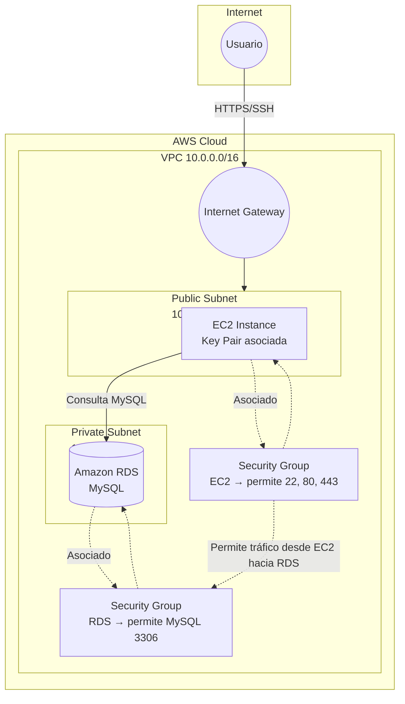

## Arquitectura del Proyecto

```mermaid
graph TB
    subgraph Internet
        User((Usuario))
    end

    subgraph AWS_Cloud [AWS Cloud]
        subgraph VPC [VPC 10.0.0.0/16]
            IGW((Internet Gateway))
            
            subgraph Public_Subnet [Public Subnet<br/>10.0.1.0/24]
                EC2[EC2 Instance<br/>Key Pair asociada]
            end
            
            subgraph Private_Subnet [Private Subnet<br/>10.0.2.0/24]
                RDS[(Amazon RDS<br/>MySQL)]
            end
            
            SG_EC2[Security Group<br/>EC2 → permite 22, 80, 443]
            SG_RDS[Security Group<br/>RDS → permite MySQL 3306]
        end
    end

    User -->|HTTPS/SSH| IGW
    IGW --> Public_Subnet
    EC2 -->|Consulta MySQL| RDS
    SG_EC2 -.-> EC2
    SG_RDS -.-> RDS
    EC2 -.->|Asociado| SG_EC2
    RDS -.->|Asociado| SG_RDS
    SG_EC2 -.->|Permite tráfico desde EC2 hacia RDS| SG_RDS
```
